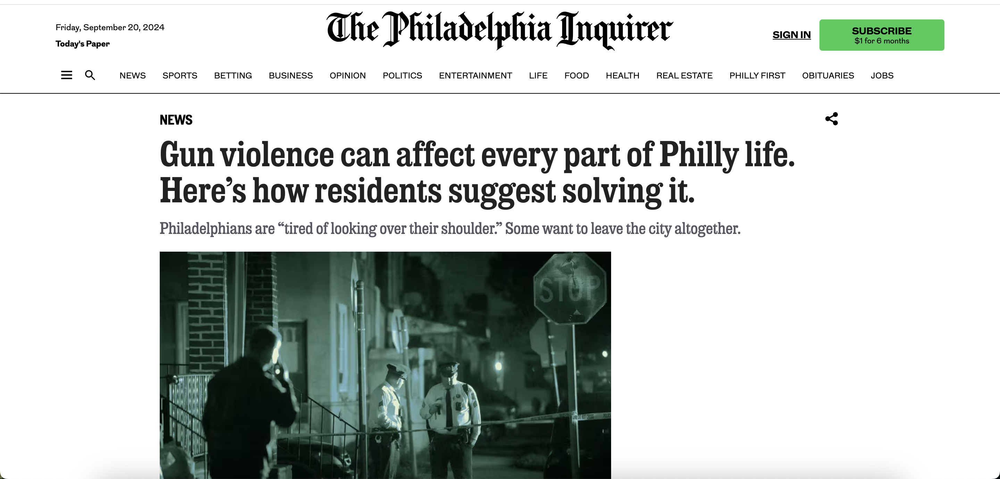

# Welcome

We are the platform engineers who have gathered to build a platform called Philly Truce.

Contributors:

- The Lead: John Jang
- The Apprentices: Karelle Hofler, Divya Praveen, Fuguo Xue, Sydney Burrell, Gaurav Varma

## Background

Philly Truce aims to use technology to reduce violent conflict in Philadelphia. Partnering with the Penn Injury Science Center's Safe Path Program, they are developing an incident-management platform based on the original Philly Truce app. This platform will provide a free, anonymous way for students, community members, and Safe Path personnel to report conflicts along school routes, preventing potentially deadly disputes. Mediators will also use the platform to resolve conflicts before they turn violent.



## Phase 3 Development Team contribution

 Please watch the video from 32:00

## Local Setup

1. Copy & paste the environment variables with one of the following commands:

```bash
cp .env.example .env #for MacOS and Linux
copy .env.example .env #for Windows
```

2. Install all the dependencies using the following command:

```bash
yarn install #or npm install or pnpm install
```

3. Now, run the project

```bash
yarn dev # or npm run dev or pnpm run dev
```

## Tech Stack

- Front-End
  - Next.js
  - TypeScript
  - Tailwind CSS
  - Shadcn
  - Next Auth

- Back-End
  - MongoDB
  - Twilio
  - Prisma ORM

## Working Tree

```
- public
- src
    - app
    - assets
    - components
    - data
    - db
    - lib
    - types

- configuration files
```
